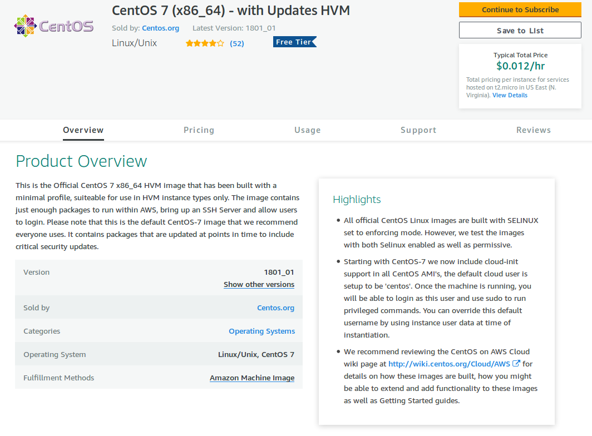

.. _aws-centos-guide:

Accepting CentOS Terms
======================

Tarmak uses CentOS images for machines in clusters. Before being able to use
these images on your AWS account you must accept the terms of use.

1. Visit the image page on the
`AWS marketplace <https://aws.amazon.com/marketplace/pp/B00O7WM7QW>`_.
Click "Continue to Subscribe in the top right"

2. Select "Manual Launch" so that we only need to accept the licence rather
   than creating instances and click on "Accept Software Terms".

.. figure:: images/aws_centos/step2.png
   :alt: Selecting manual launch

You should see this confirmation:

.. figure:: images/aws_centos/step3.png
   :alt: Completed screen

After you see this screen you're done. Unfortunately, sometimes it can take as
long as a few hours for your account to be permitted to run instances with the
images.
