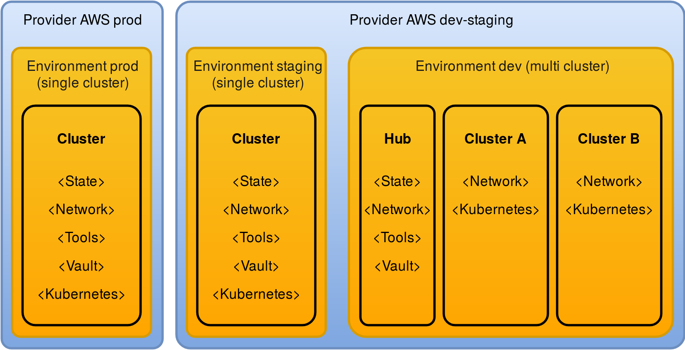

.. _introduction:

Introduction
============

What is Tarmak?
---------------

Tarmak is a toolkit for Kubernetes cluster lifecycle management. It focuses on
best practice cluster security and cluster management/operation. It has been
built from the ground-up to be cloud provider-agnostic and hence provides a
means for consistent and reliable cluster deployment and management, across
clouds and on-premises environments.

Tarmak and its underlying components are the product of Jetstack_'s work with 
its customers to build and deploy Kubernetes in production at scale.

.. _Jetstack: https://www.jetstack.io/

Design goals
------------

Goals
*****

* Build and manage as similar as possible cluster deployments across different
  cloud and on-premises environments.

* Combine tried-and-tested and well-understood system tools throughout the
  stack to provide production-ready and ready-to-use clusters.

* Follow security best practices.

* Support for a fully automated CI/CD operation.

* Provide minimally invasive upgrades, which can be predicted using dry-runs.

* Have a testable code base, that follows KISS and DRY. For example, avoidance
  of convoluted bash scripts that are environment and operating
  system-specific.

* Provide a tool-independent CLI experience, that simplifies common tasks and
  allows to investigate cluster status and health quickly and easily.

* Allow customisation to parts of the code, to follow internal standards.

Non-goals
*********

* Reinventing the wheel

.. _architecture_overview:

Architecture overview
---------------------

.. todo::
   A high-level architecture diagram is coming soon!

Tarmak configuration resources
******************************

The Tarmak configuration, which by default is located in
``~/.tarmak/tarmak.yaml``, uses Kubernetes' APItooling consists of different
resources. While the Tarmak specific resources Providers_ and Environments_ are
defined by the Tarmak project, Clusters_ are derived from a draft version of
the `Cluster API
<https://github.com/kubernetes/community/tree/master/wg-cluster-api>`_. This is
a community effort to have a standardised way of defining Kubernetes clusters.

.. note::
   Although we do not anticipate breaking changes in our configuration, at this
   stage this cannot be absolutely guaranteed. Through Kubernetes' API tooling
   we have the chance to migrate between different versions of the
   configuration in a controlled way.

.. _providers_resource:

Providers
^^^^^^^^^

A Provider contains credentials and information for cloud provider
accounts. A Provider can be used for many Environments, while every Environment
has to be associated with exactly one Provider.

Currently the only supported Provider is **Amazon**. A Provider object for
Amazon is referencing credentials to log in as an AWS account. 

.. _environments_resource:

Environments
^^^^^^^^^^^^

An Environment consists of one or more Kubernetes clusters. If an Environment
has exactly one cluster, it is called a Single Cluster Environment. A Cluster
in such an environments also contains the Environment-wide tooling.

For Multi-Cluster Environments, this tooling is placed into a special
Cluster resource that is called ``hub``. This allows to reuse the Environment-
wide tooling like bastion nodes and Vault throughout all Clusters 

.. _clusters_resource:

Clusters
^^^^^^^^

A Cluster resource represents exactly one Kubernetes cluster. The only
exception for that rule is the ``hub`` in Multi Cluster Environment: Hubs don't
contain a Kubernetes cluster, as they are just the place where the Environment-wide 
tooling is placed.

All instances in a Cluster are defined by an InstancePool_.

Stacks
^^^^^^

The Cluster-specific Terraform code is broken down into separate, self-contained Stacks. 
The Stacks use Terraform's remote state feature to share outputs between them. 
The execution order of Stacks is important some depend on the actions of other Stacks. 
Tarmak currently uses these Stacks:

* ``state``: contains the stateful resources of the Cluster (data stores,
  persistent disk volumes).
* ``network``: networks sets-up the necessary network objects to allow communication
* ``tools``: tools contains the Environment wide tooling, like bastion and CI/CD instances
* ``vault``: spins up a Vault cluster, backed by a Consul key/value store
* ``kubernetes``: Kubernetes' master, worker and Etcd instances

   This is how a single cluster production setup could look like. While the dev
   environment allows for multiple clusters (e.g. each with different features
   and/or team members), the staging and production environments consist of a
   single cluster each. The same AWS account is used for the dev and staging
   environment, while production runs in separate account.

.. _InstancePool:

InstancePools
^^^^^^^^^^^^^

Every Cluster contains InstancePools that group instances of a similar type
together. Every InstancePool has a name and a role attached to it. Other
parameters allow to customise the instances regarding size, count and location, 
for example.

These roles are defined:

* ``bastion``: Bastion instance within the ``tools`` stack. Has a public IP
  address and allows Tarmak to connect to other instances that only have
  private IP addresses.
* ``vault``: Vault instance within the ``vault`` stack. Has persistent disks,
  that back a Consul cluster, which backs Vault itself.
* ``etcd``: Stateful instances within ``kubernetes`` stack. Etcd is the
  key-value store backing Kubernetes and possibly other components, including 
  overlay networks (i.e. Calico).
* ``master``: Stateless Kubernetes master instances.
* ``worker``: Stateless Kubernetes worker instances.

Tools used under the hood
-------------------------

Tarmak is backed by tried-and-tested tools, effectively acting as glue and
automation, managed by a CLI UX. These tools are plugable, but at this stage we
use the following:

Docker
******

Docker is used to package the tools necessary and run them in a uniform
environment across different operating systems. This allows Tarmak to be
supported on Linux and Mac OS X (and potentially Windows in the future).

Packer
******

Packer help to build reproducible VM images in various environments. Through
Packer we build custom VM images that contain the latest kernel upgrades and a
supported puppet version.

Terraform
*********

Terraform is a well-known tool for infrastructure provisioning in public and
private clouds. We use Terraform to manage the lifecycle of resources and store
the state of clusters in Terraform remote state.

Puppet
******

As soon as instances are spun up, Tarmak uses Puppet to configure them.  Puppet
is used in a 'masterless' architecture, to not require the complexity of a full
Puppet master setup. All the services are configured in such a way that once
converged, the instance can run without any further involvement of Puppet.

Why Puppet over other means of configuration (i.e. bash scripts, Ansible,
Chef)? The main reason is its testability at various levels and also the
concept of explicit dependency definition (allowing a tree of dependencies to
be built which helps to predict the changes with a dry-run).

Systemd
*******

Systemd units are used to maintain the dependencies between services.

Systemd timers enable periodic application execution, such as for certificate renewal.
